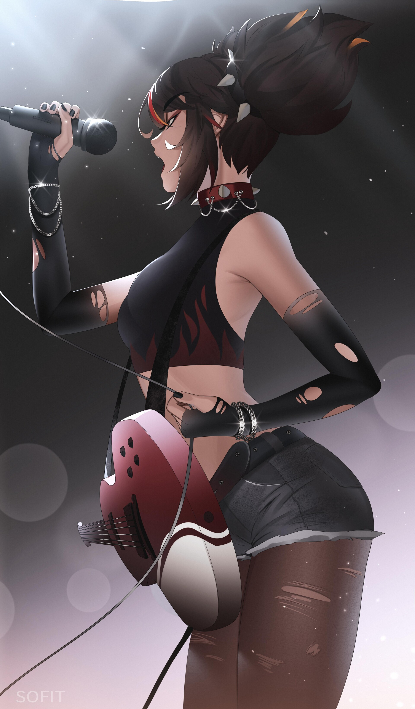
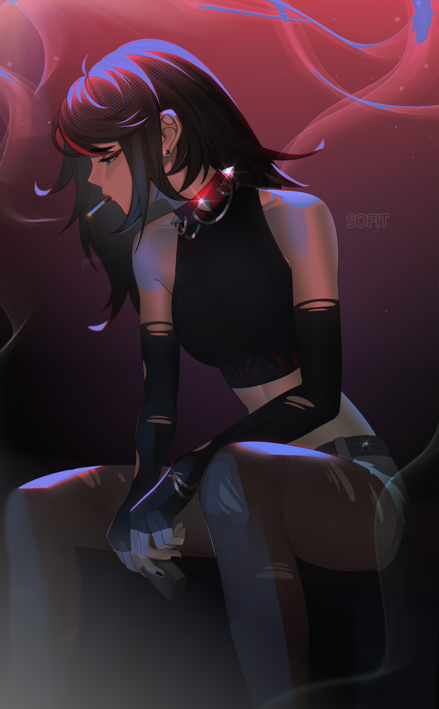

  
  

 
  .NET/Game Developer, doing barely working stuff here:  
    [@MentallyStable4sure](https://github.com/MentallyStable4sure) 
    
  <!--Site: [WIP]() -->
  
  🌱 Currently working on: Launcher, Gacha Open-World Slasher, FarmSim \
  💬 Feel free to contact me thru links down below c: \
  💜 Hobby: Drawing, singing, piano, guitar, games, anime \
  🎵 Into hyperpop, death metal and alternative rock. \
  ⚡ 5 years of commercial experience with Unity, 2 with .NET and a year with Python
    
   Image by [Sofit](https://twitter.com/_Sofit__/status/1557450229758271488)
     
     https://twitter.com/_Sofit__/status/1557450229758271488
  

  
  

    
    https://twitter.com/_Sofit__/status/1595540274385752064
    
  ## Tech Stack
    
- 
  
  
  
- 
  
  
  
- 
  
  
  
- 
  
  
  
  
  
  
  
  
- 
  
  
  
  
  
  

 

  
 
## Connect with Me

  
  
  
  <!-- Footer -->
  

___

